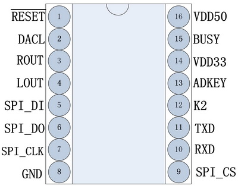

# arduino library WT2003M02 mp3 decoder v3.0

Library for the WT2003M02 MP3 decoder board v3.0. This library is designed to control the WT2003M02 board via UART.

## WT2003M02 v3.0

The module can be bought here: https://www.2ram.ru/l/57

This board looks like this:

Pinout:

## Connection

    Hardware Connections:
    WT2003M02 V3.0 -> Arduino Pin
    -------------------------------------
    TXO                  ->   5
    RXI                  ->   4
    5V                   ->  5V
    GND                  -> GND
    
    WT2003M02 V3.0 -> WeMos D1 mini Pin
    -------------------------------------
    TXO                  ->  D1
    RXI                  ->  D2
    5V                   ->  5V
    GND                  -> GND

